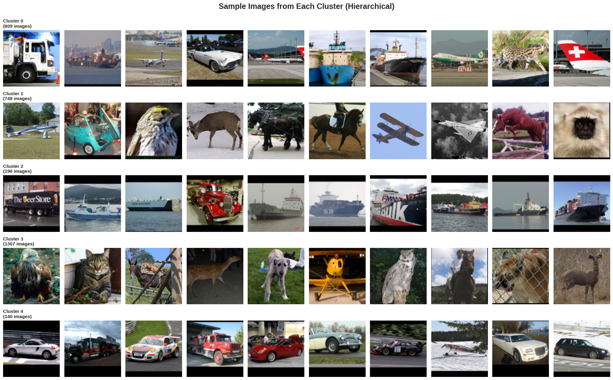
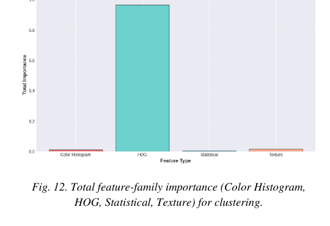
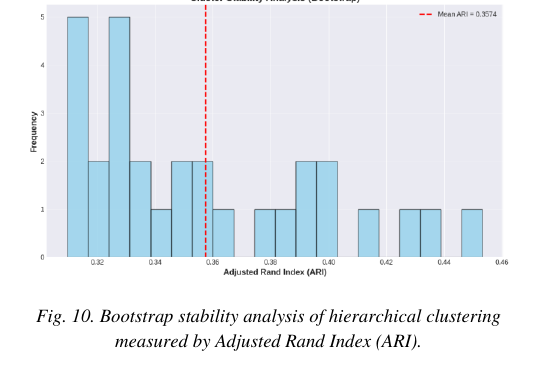

# STL-10 Cluster Discovery - Handcrafted Features vs. Natural Image Structure

Unsupervised clustering of 3,000 STL-10 images (2,000 train / 1,000 test) using only
handcrafted descriptors  no labels, no deep features. The real question this project
asks isn't "can we get 10 clusters that match the 10 STL-10 classes" (we don't try to),
it's whether a classic color + texture + shape pipeline finds *any* stable structure at
all in natural images, and what that structure turns out to represent when it does.



Full write-up: [Press to see the paper](Discovering-Image-Clusters-in-STL10-Using-Unsupervised-Machine-Learning.pdf)

## Data

STL-10, 96×96 RGB, 3,000 labeled images (2,000 train / 1,000 test) across 10 classes.
Labels are kept out of clustering entirely and only reattached afterward, purely to sanity-check
what the discovered groups actually correspond to.

## Method

Each image becomes a 4,501-d vector: 96-d color histogram, 4,356-d HOG, 26-d LBP texture,
23-d simple stats (mean/std/min/max/quartiles per channel). Standardized, then PCA.

```python
color_hist = np.concatenate([np.histogram(img[:,:,c], bins=32, range=(0,256))[0] for c in range(3)])
hog_feat   = hog(rgb2gray(img), orientations=9, pixels_per_cell=(8,8), cells_per_block=(2,2))
```

95% variance needs 981 components  but more variance retained isn't the same as more
clusterable variance. Sweeping PCA dims and re-scoring the resulting clusters each time
shows silhouette actually *drops* as dimensions climb from 50 to 250:

$$
\text{Silhouette}(50) \approx 0.062 \;\longrightarrow\; \text{Silhouette}(250) \approx 0.031
$$

So the embedding used for clustering is 50-d, chosen by optimizing cluster quality
directly rather than by a fixed variance threshold. K is chosen the same way  sweep
K=5..20, take whichever maximizes silhouette / Calinski–Harabasz. Both land on **K=5**.

Four algorithms, same 50-d space, same K:

| Algorithm | Silhouette | Notes |
|---|---|---|
| K-Means | 0.0212 | sizes [769, 413, 386, 428, 1004] |
| **Hierarchical (Ward)** | **0.0250** | sizes [609, 748, 196, 1307, 140] |
| GMM (full cov) | 0.0242 | sizes [378, 408, 1198, 662, 354] |
| DBSCAN (ε=0.5, minPts=5) |  | labels *everything* as noise |

DBSCAN's total failure is itself informative: it means there's no pocket of the 50-d
space that's meaningfully denser than its surroundings  the data is a continuum, not a
set of islands, which is exactly what shows up later in the bootstrap stability number.

## What the clusters actually are

$$
IoU\text{-flavored intuition aside} \quad\Rightarrow\quad \text{these are not the 10 STL-10 classes}
$$

Running a Random Forest to predict cluster ID from the raw features and reading off
importances answers the "what is clustering actually keying on" question directly:

$$
\text{HOG contributes } 96.64\%\text{ of total importance vs. } 1.71\%\text{ (texture)} + 1.17\%\text{ (color)} + 0.48\%\text{ (stats)}.
$$



That's not a subtle skew  the 4,501-d "multi-modal" feature vector behaves almost like a
pure edge/shape descriptor in practice, mostly because HOG alone is 4,356 of those 4,501
dimensions. The clusters read as: maritime/blue-background scenes, land vehicles, two
loosely-separated "animal-ish" groups split mainly by brightness, and one large 1,307-image
catch-all bucket that mostly means "didn't strongly match an edge/shape pattern." Cluster
purity against the true labels is never computed as a target metric  that would be
scoring the clustering against a task it was never asked to solve.

## Stability

$$
\text{ARI}_{\text{bootstrap}} = 0.3574 \pm 0.0413 \quad (30\text{ iterations, }80\%\text{ resample})
$$



0.35 is moderate agreement, not the >0.5 usually wanted for "stable." Combined with
DBSCAN finding zero dense regions, the honest read is: the structure is real and
reproducible in its broad strokes (brightness, water vs. land, vehicle vs. animal) but the
boundaries between clusters are soft, and individual borderline images will hop clusters
under small perturbations. Repeated-seed testing (20 seeds) confirms this isn't algorithm
noise  mean silhouette stays pinned at 0.0200 ± small variance across seeds, so the
weakness is in the data geometry / representation, not in randomness.

## Known limitation

HOG's 4,356 dimensions structurally drown out color and texture before clustering even
starts, since importance roughly tracks dimensionality here. A weighted-fusion or
dimensionality-balanced version of the pipeline (e.g. capping each family's share of the
input) would be the natural next test  right now "shape-driven" isn't a finding about
natural images so much as an artifact of how the feature vector was built.
